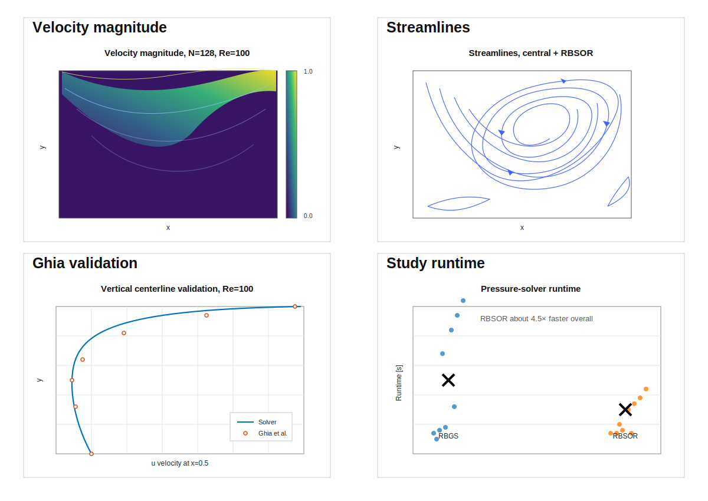

# Lid-Driven Cavity Flow Solver in C++

<p align="center">
  
  
  
  <a href="https://kandil2001.github.io/">
    
  </a>
</p>

A two-dimensional incompressible-flow solver for the classical lid-driven cavity benchmark, written in C++17. I built this project to have a clear serial CFD baseline that can be compiled from the terminal, run as a parameter study, and extended later with OpenMP, MPI, or CUDA.

The solver uses a pressure-correction workflow, exports the numerical fields as CSV files, and uses Python only for post-processing and plots. This makes the repository easy to run on Linux, WSL, or a university cluster.

This project is part of the same CFD benchmark series as [LidCavity_MATLAB](https://github.com/Kandil2001/LidCavity_MATLAB), but it is presented as its own C++ implementation rather than as a line-by-line translation.

<p align="center">
  
</p>

## What is included

- Serial C++17 lid-driven cavity solver
- Structured collocated Cartesian grid
- Pseudo-transient pressure-correction algorithm
- First-order upwind and central convection schemes
- Red-black Gauss-Seidel and red-black SOR pressure solvers
- Validation against Ghia et al. centreline velocity data
- CSV export for fields, residual histories, and study summaries
- Python post-processing for contours, streamlines, validation plots, and runtime comparisons
- Bash scripts for smoke, single, quick, medium, and full studies

The full parameter study runs 36 combinations:

```text
3 meshes × 3 Reynolds numbers × 2 schemes × 2 pressure solvers × 1 implementation
```

## Representative result

The overview above uses a refined-grid case, `N = 128`, `Re = 100`, central differencing, and RBSOR. I chose this case as the main visual because it gives the cleanest validation against the Ghia benchmark while still showing the flow field clearly.

The high-Reynolds-number case below is useful as a second visual because it shows the stronger recirculation structure at `Re = 1000`.

| Flow field | Centreline validation |
|---|---|
|  |  |
|  |  |

## Numerical approach

The solver advances the non-dimensional incompressible Navier-Stokes equations through pseudo-time. At each outer iteration it predicts the velocity field, solves a pressure-correction Poisson equation, corrects velocity and pressure, reapplies the wall boundary conditions, and records convergence diagnostics.

A more detailed description is available in [docs/METHODOLOGY.md](docs/METHODOLOGY.md).

## Study observations

- `22/36` cases met the selected Ghia centreline-error limits.
- All `N = 128` cases met the selected validation limits.
- The best validation behaviour came from the refined-grid central-difference cases.
- RBSOR gave almost the same validation error as RBGS while strongly reducing pressure-solver cost.
- The full study took about **4.83 hours** on the machine where the uploaded results were generated.

The validation limits are practical comparison thresholds, not a replacement for a formal grid-independence or verification study. See [docs/RESULTS.md](docs/RESULTS.md) for the full discussion.

| Re | Best case | N | Scheme | Pressure solver | Ghia `u` L2 | Ghia `v` L2 |
|---:|---:|---:|---|---|---:|---:|
| 100 | 28 | 128 | central | RBSOR | 0.0031 | 0.0041 |
| 400 | 32 | 128 | central | RBSOR | 0.0539 | 0.0652 |
| 1000 | 36 | 128 | central | RBSOR | 0.1102 | 0.1109 |


## Run the project

On Linux, WSL, or a university cluster:

```bash
bash scripts/run_smoke_test.sh   # small compilation/output check
bash scripts/run_single.sh       # representative case
bash scripts/run_quick.sh        # reduced study
bash scripts/run_medium.sh       # medium study
bash scripts/run_full.sh         # full 36-case study
```

Generated files are written to `results/data/` and `results/figures/`. Detailed instructions are in [docs/RUNNING.md](docs/RUNNING.md).

## Repository layout

```text
src/           C++ solver
scripts/       build, run, plot, and clean scripts
postprocess/   Python plotting and result-summary tools
assets/        selected figures and published summary data
docs/          methodology, results, validation, scope, and running notes
results/       generated output; full case output is ignored by Git
.github/       smoke-test workflow
```

## Requirements

For the C++ solver:

```bash
g++ with C++17 support
```

For the Python post-processing:

```bash
python3 -m pip install -r requirements.txt
```

On Windows, WSL is recommended because the scripts are written for a Linux-style terminal.

## Limitations

This is an educational solver, not a replacement for a production CFD package. It uses a simple pressure-correction approach on a collocated grid and does not include multigrid acceleration or Rhie-Chow interpolation. The refined-grid results are useful, but the convergence strategy and high-Reynolds-number behaviour are still the main areas for improvement.

## Planned extensions

1. Improve convergence control and stopping criteria.
2. Split the solver into smaller C++ modules.
3. Add an OpenMP implementation and compare it with `serial_cpp`.
4. Add benchmark tables for accuracy, runtime, and speedup.
5. Add MPI or CUDA versions later.

## Reference

Ghia, U., Ghia, K. N., & Shin, C. T. (1982). *High-Re solutions for incompressible flow using the Navier-Stokes equations and a multigrid method*. Journal of Computational Physics, 48(3), 387-411.

## Author

Ahmed Kandil — [Portfolio](https://kandil2001.github.io/) · [LinkedIn](https://www.linkedin.com/in/ahmed-kandil03/)

Released under the [MIT License](LICENSE).
