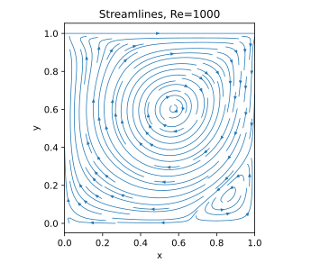
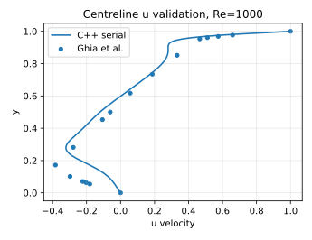
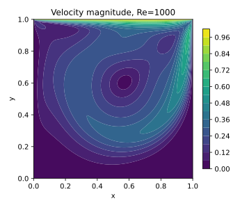
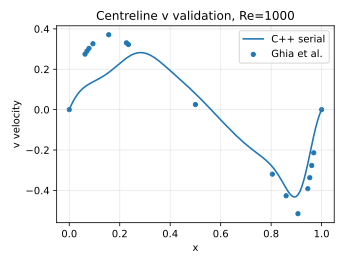

# Lid-Driven Cavity Flow Solver in C++

<p align="center">
  
  
  
  <a href="https://kandil2001.github.io/">
    
  </a>
</p>

A C++17 implementation of the two-dimensional lid-driven cavity benchmark.

This repository is one part of a larger project where the same CFD benchmark will be implemented and compared in MATLAB, C++, C, Python, OpenMP, MPI, CUDA, and OpenFOAM. The goal is to keep the physical setup the same across all versions, then compare accuracy, runtime, implementation style, and scalability.

This version is the **serial C++ baseline**. It is not meant to be the fastest version yet. It is meant to be clean, readable, and reliable enough to compare against the parallel versions later.

## What is included

- Structured collocated Cartesian grid
- Pseudo-transient pressure-correction algorithm
- Serial C++17 solver
- First-order upwind and central convection schemes
- Red-black Gauss-Seidel and red-black SOR pressure solvers
- Validation against Ghia et al. centreline velocity data
- CSV export for fields, residual histories, and study summaries
- Python post-processing for contours, streamlines, validation plots, and runtime comparisons

The full parameter study runs 36 combinations:

```text
3 meshes × 3 Reynolds numbers × 2 schemes × 2 pressure solvers × 1 implementation
```

## Representative result

For all implementations in this benchmark series, I want to keep the result layout the same: flow-field plots on one side and Ghia centreline validation on the other. This makes the MATLAB, C++, and later OpenMP/MPI/CUDA/OpenFOAM versions easier to compare.

For the C++ repo, the refined-grid central/RBSOR cases are the best cases to show first because they give the strongest validation behaviour while keeping the pressure solve faster than RBGS.

| Best refined cases | N | Scheme | Pressure solver | Ghia `u` L2 | Ghia `v` L2 |
|---:|---:|---|---|---:|---:|
| Re = 100 | 128 | central | RBSOR | 0.0031 | 0.0041 |
| Re = 400 | 128 | central | RBSOR | 0.0539 | 0.0652 |
| Re = 1000 | 128 | central | RBSOR | 0.1102 | 0.1109 |

The `Re = 1000` case below is useful visually because the main recirculation region is clearer.

| Flow field | Centreline validation |
|---|---|
|  |  |
|  |  |

## Numerical approach

The solver advances the non-dimensional incompressible Navier-Stokes equations through pseudo-time. At each outer iteration it predicts the velocity field, solves a pressure-correction Poisson equation, corrects velocity and pressure, reapplies the wall boundary conditions, and records convergence diagnostics.

A more detailed description is available in [docs/METHODOLOGY.md](docs/METHODOLOGY.md).

## Study observations

- `22/36` cases met the selected Ghia centreline-error limits.
- All `N = 128` cases met the selected validation limits.
- The refined-grid central-difference cases gave the best validation behaviour.
- RBSOR gave almost the same validation error as RBGS while strongly reducing pressure-solver cost.
- The full study took about **4.83 hours** on the machine where the uploaded results were generated.

The validation limits are practical comparison thresholds, not a replacement for a formal verification or grid-independence study. See [docs/RESULTS.md](docs/RESULTS.md) for the full discussion.


## Run the project

On Linux, WSL, or a university cluster:

```bash
bash scripts/run_smoke_test.sh   # small compilation/output check
bash scripts/run_single.sh       # representative case
bash scripts/run_quick.sh        # reduced study
bash scripts/run_medium.sh       # medium study
bash scripts/run_full.sh         # full 36-case study
```

Generated files are written to `results/data/` and `results/figures/`. Detailed instructions are in [docs/RUNNING.md](docs/RUNNING.md).

## Repository layout

```text
src/           C++ solver
scripts/       build, run, plot, and clean scripts
postprocess/   Python plotting and result-summary tools
assets/        selected figures and published summary data
docs/          methodology, results, validation, scope, and running notes
results/       generated output; full case output is ignored by Git
.github/       smoke-test workflow
```

## Requirements

For the C++ solver:

```bash
g++ with C++17 support
```

For the Python post-processing:

```bash
python3 -m pip install -r requirements.txt
```

On Windows, WSL is recommended because the scripts are written for a Linux-style terminal.

## Limitations

This is an educational solver, not a replacement for a production CFD package. It uses a collocated grid without Rhie-Chow interpolation and an iterative pressure solver without multigrid acceleration. The convergence strategy and high-Reynolds-number behaviour are the main areas for further improvement.

## Next steps

- Improve convergence control and stopping criteria
- Split the solver into smaller C++ modules
- Add the OpenMP version and compare it with `serial_cpp`
- Add MPI and CUDA versions as separate implementations
- Add Python, C, and OpenFOAM versions under the same benchmark specification
- Build one comparison table for accuracy, runtime, and speedup across all implementations

## Reference

Ghia, U., Ghia, K. N., & Shin, C. T. (1982). *High-Re solutions for incompressible flow using the Navier-Stokes equations and a multigrid method*. Journal of Computational Physics, 48(3), 387-411.

## Author

Ahmed Kandil — [Portfolio](https://kandil2001.github.io/) · [LinkedIn](https://www.linkedin.com/in/ahmed-kandil03/)

Released under the [MIT License](LICENSE).
