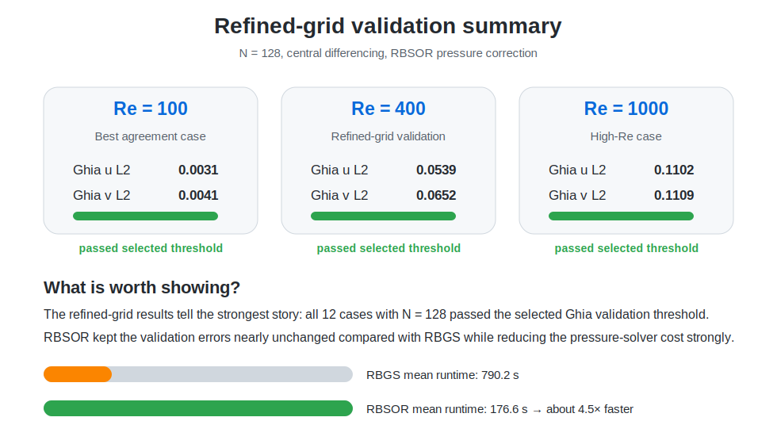

# Lid-Driven Cavity Flow Solver in C++

<p align="center">
  
  
  
  
  <a href="https://kandil2001.github.io/">
    
  </a>
</p>

A compact C++17 solver for the classical two-dimensional lid-driven cavity benchmark.

This repository is the **serial C++ baseline** of a larger CFD benchmark series. The same physical problem is solved across different languages and implementation styles so that accuracy, runtime, code structure, and scalability can be compared fairly across MATLAB, C++, C, Python, OpenMP, MPI, CUDA, and OpenFOAM.

The goal here is not to hide the numerical limitations. The goal is to build a clean, reproducible CFD baseline, validate it against a standard benchmark, and make later parallel versions easier to judge.

---

## Why this case matters

The lid-driven cavity is simple to define but still demanding enough to test a CFD solver:

- a moving top wall drives the flow,
- no-slip walls create strong shear and recirculation,
- the solution changes clearly with Reynolds number,
- benchmark velocity profiles are available from Ghia et al.,
- the case is widely used for checking incompressible-flow solvers.

That makes it a good problem for comparing numerical methods and implementation performance without changing the physics each time.

---

## What is included

- Structured collocated Cartesian grid
- Pseudo-transient pressure-correction algorithm
- Serial C++17 implementation
- First-order upwind and central convection schemes
- Red-black Gauss-Seidel pressure solver
- Red-black SOR pressure solver
- Validation against Ghia et al. centreline velocity data
- CSV export for field data, residual histories, and study summaries
- Python post-processing for contours, streamlines, validation plots, residuals, and runtime comparisons

The full serial study contains:

```text
3 meshes × 3 Reynolds numbers × 2 convection schemes × 2 pressure solvers × 1 implementation = 36 simulations
```

---

## Representative result

The README result uses one of the strongest and most useful cases from the study:

```text
N = 128
Re = 1000
convection scheme = central
pressure solver = RBSOR
implementation = serial_cpp
```

This case is visually useful because the main recirculation region is clear, and it is also a good validation example because it belongs to the refined-grid cases that passed the selected Ghia error threshold.

| Flow field | Centreline validation |
|---|---|
|  |  |
|  |  |

---

## Validation approach

Validation is performed against the classical Ghia, Ghia & Shin lid-driven cavity data. Two centreline profiles are compared:

- horizontal velocity `u(y)` along the vertical centreline `x = 0.5`,
- vertical velocity `v(x)` along the horizontal centreline `y = 0.5`.

For each validated case, the code reports both `L2` and `Linf` errors. The thresholds used in this repository are practical comparison thresholds for this benchmark series. They are useful for classifying whether a numerical setup behaves reasonably, but they are not a replacement for a formal verification study.

### Best refined-grid validation cases

The strongest validation story comes from the `N = 128`, central-difference, RBSOR cases:

| Reynolds number | Case | Mesh | Scheme | Pressure solver | Ghia `u` L2 | Ghia `v` L2 | Runtime [s] |
|---:|---:|---:|---|---|---:|---:|---:|
| 100 | 28 | 128 | central | RBSOR | 0.0031 | 0.0041 | 441.7 |
| 400 | 32 | 128 | central | RBSOR | 0.0539 | 0.0652 | 527.6 |
| 1000 | 36 | 128 | central | RBSOR | 0.1102 | 0.1109 | 647.6 |



The important point is not just that `22/36` cases passed. A better interpretation is:

> Coarse meshes are useful for quick checks and sensitivity studies, while the refined-grid cases provide the strongest validation evidence.

In the current full study, all `N = 128` cases passed the selected validation thresholds.

---

## Study observations

From the uploaded full serial C++ study:

- `36` simulations were executed.
- `22/36` cases passed the selected Ghia centreline-error thresholds.
- `12/12` refined-grid cases with `N = 128` passed.
- Central differencing on the refined grid gave the best validation behaviour.
- RBSOR produced almost the same validation error as RBGS while strongly reducing the pressure-solver cost.
- The full study took about **4.83 hours** on the machine where the uploaded results were generated.


---

## Numerical method

The solver advances the non-dimensional incompressible Navier-Stokes equations in pseudo-time.

At each outer iteration it:

1. predicts the velocity field,
2. solves a pressure-correction Poisson equation,
3. corrects velocity and pressure,
4. reapplies wall boundary conditions,
5. records residuals and convergence diagnostics.

A more detailed description is available in [`docs/METHODOLOGY.md`](docs/METHODOLOGY.md).

---

## Run the project

On Linux, WSL, or a university cluster:

```bash
bash scripts/run_smoke_test.sh   # small compilation/output check
bash scripts/run_single.sh       # representative N=128, Re=1000 case
bash scripts/run_quick.sh        # reduced study
bash scripts/run_medium.sh       # medium study
bash scripts/run_full.sh         # full 36-case study
```

To regenerate plots after running cases:

```bash
bash scripts/plot_results.sh
```

Generated files are written to:

```text
results/data/       CSV outputs
results/figures/    generated figures
```

Detailed running instructions are in [`docs/RUNNING.md`](docs/RUNNING.md).

---

## Repository layout

```text
src/           C++ solver
scripts/       build, run, plot, and clean scripts
postprocess/   Python plotting and result-summary tools
assets/        selected figures and published summary data
docs/          methodology, results, validation, scope, and running notes
results/       generated output; full case output is ignored by Git
.github/       smoke-test workflow
```

---

## Requirements

For the C++ solver:

```bash
g++ with C++17 support
```

For Python post-processing:

```bash
python3 -m pip install -r requirements.txt
```

On Windows, WSL is recommended because the scripts are written for a Linux-style terminal.

---

## Limitations

This is an educational CFD solver and benchmark baseline, not a replacement for a production CFD package.

Current limitations include:

- collocated grid without Rhie-Chow interpolation,
- iterative pressure solver without multigrid acceleration,
- convergence strategy still needs improvement,
- high-Reynolds-number cases need more tuning before being presented as final benchmark-quality results,
- all current full-study cases reached the configured maximum outer-iteration limit, so validation should be read together with residual histories.

These limitations are kept visible because they make the next development steps clear.

---

## Next steps

- Improve convergence stopping criteria
- Add stronger validation plots for all Reynolds numbers on the refined grid
- Add grid-convergence plots that separate `Re = 100`, `Re = 400`, and `Re = 1000`
- Split the solver into smaller C++ modules
- Add OpenMP and compare against this serial baseline
- Add MPI and CUDA versions as separate implementations
- Add Python, C, and OpenFOAM versions under the same benchmark specification
- Build one comparison table for accuracy, runtime, and speedup across the full benchmark suite

---

## Reference

Ghia, U., Ghia, K. N., & Shin, C. T. (1982). *High-Re solutions for incompressible flow using the Navier-Stokes equations and a multigrid method*. Journal of Computational Physics, 48(3), 387–411.

---

## Author

Ahmed Kandil — [Portfolio](https://kandil2001.github.io/) · [LinkedIn](https://www.linkedin.com/in/ahmed-kandil03/)

Released under the [MIT License](LICENSE).
