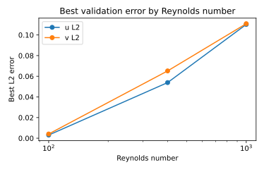
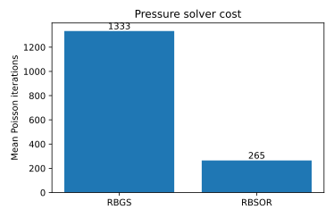

# Results

This page summarizes the full serial C++ study saved in:

```text
results/data/study_summary_full.csv
```

## Study size

The full study contains 36 cases:

```text
3 meshes × 3 Reynolds numbers × 2 convection schemes × 2 pressure solvers × 1 serial C++ implementation
= 36 simulations
```

The current implementation is labeled:

```text
serial_cpp
```

It is the baseline implementation for future OpenMP, MPI, CUDA, or other accelerated versions.

## Main result story

The most important observation is that the solver behaves much better on the refined grid. This is expected for the lid-driven cavity benchmark because the centreline velocity profiles and corner-vortex behaviour become more sensitive at higher Reynolds numbers.

From the current full study:

- `36` simulations were executed.
- `22/36` cases passed the selected Ghia centreline validation threshold.
- `12/12` refined-grid cases with `N = 128` passed the selected validation threshold.
- The `N = 128`, central-difference cases gave the best validation behaviour.
- RBSOR gave almost the same validation error as RBGS but with much lower runtime.

So the better way to read the results is not simply “22 out of 36 passed.” A more useful interpretation is:

> The coarse-grid cases are useful for speed and sensitivity checks, while the refined-grid cases provide the strongest validation evidence.

## Best validation case at each Reynolds number

| Re | Case | N | Scheme | Pressure solver | Ghia u L2 | Ghia v L2 | Runtime [s] |
|---:|---:|---:|---|---|---:|---:|---:|
| 100 | 28 | 128 | central | RBSOR | 0.0031 | 0.0041 | 441.7 |
| 400 | 32 | 128 | central | RBSOR | 0.0539 | 0.0652 | 527.6 |
| 1000 | 36 | 128 | central | RBSOR | 0.1102 | 0.1109 | 647.6 |

These three cases are the best cases to show in the README or a portfolio because they combine good validation behaviour with the faster pressure solver.

## Pressure solver comparison

| Pressure solver | Cases | Mean runtime [s] | Total runtime [s] | Mean Poisson iterations |
|---|---:|---:|---:|---:|
| RBGS | 18 | 790.2 | 14224.3 | 1333.1 |
| RBSOR | 18 | 176.6 | 3178.9 | 264.5 |

RBSOR was about **4.5× faster** overall and used about **5× fewer pressure iterations** on average than RBGS.

This makes RBSOR the better default choice for the current solver.

## Mesh refinement effect

The study clearly shows that the validation improves with mesh refinement. For example, at `Re = 1000` with the central scheme and RBSOR:

| N | Case | Ghia u L2 | Ghia v L2 | Validation |
|---:|---:|---:|---:|---|
| 32 | 12 | 0.2091 | 0.3051 | did not pass |
| 64 | 24 | 0.1810 | 0.2428 | did not pass |
| 128 | 36 | 0.1102 | 0.1109 | passed |

This is a good result for the current version because it shows the expected direction: the solution improves as the grid becomes finer.

## Runtime

The full 36-case study took approximately **4.83 hours** on the machine where the uploaded results were generated.

The largest cases are naturally the most expensive. For future development, the serial C++ implementation is a useful baseline before adding OpenMP or MPI.

## Selected plots





## Interpretation

The current code is a solid serial baseline. It captures the expected cavity-flow structure and gives validated centreline profiles on the refined grid. The most important improvement is not changing the result presentation, but improving the solver itself next:

1. improve convergence stopping criteria,
2. tune the high-Reynolds-number cases,
3. split the C++ code into smaller modules,
4. add OpenMP and compare the speedup against this serial baseline,
5. later add MPI or CUDA versions.
